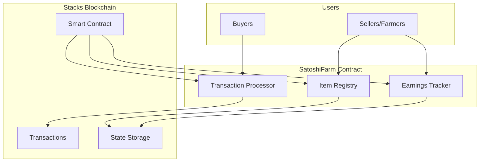
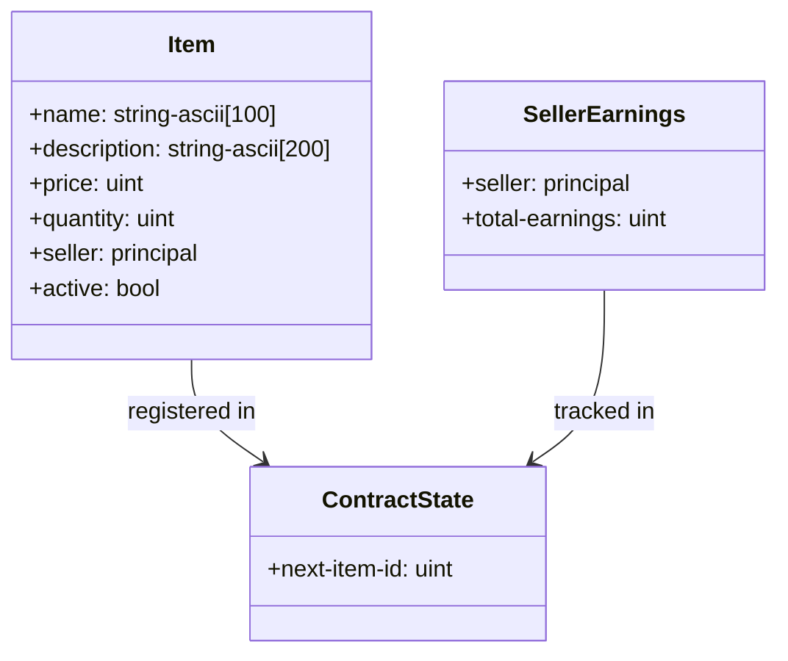
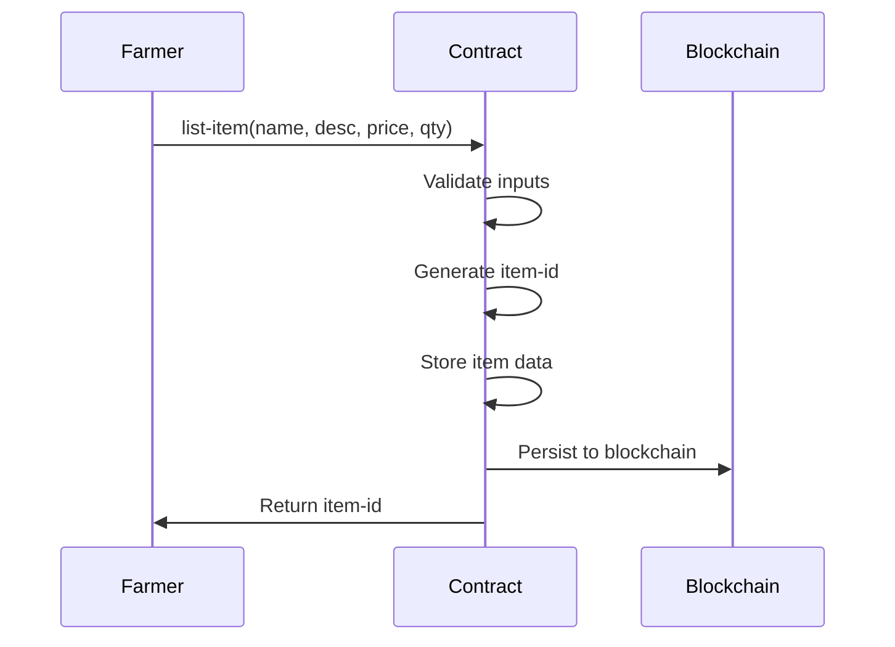
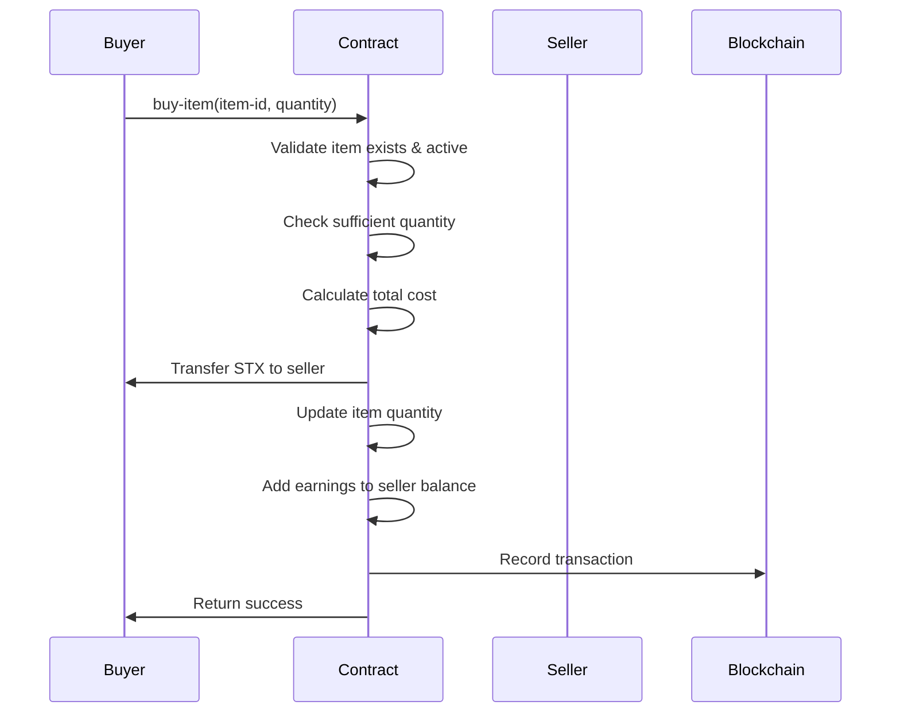
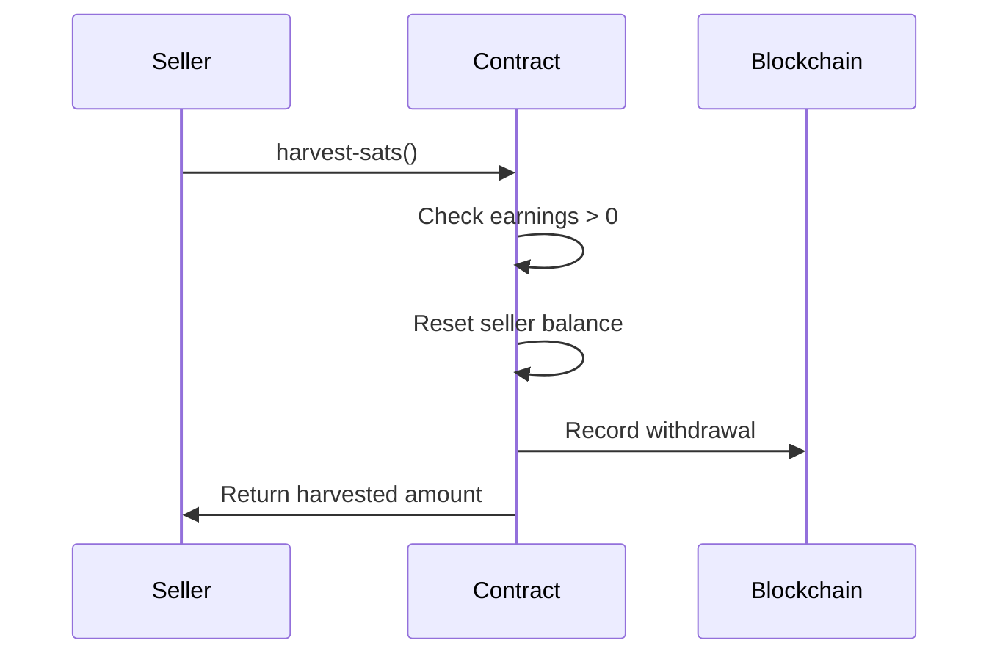

# SatoshiFarm

[](https://github.com/hirosystems/clarinet)
[](https://stacks.co)
[](https://opensource.org/licenses/MIT)

> A decentralized farmers marketplace smart contract on Stacks blockchain, enabling direct peer-to-peer agricultural commerce.

## Table of Contents

- [Overview](#overview)
- [Key Features](#key-features)
- [Architecture](#architecture)
- [How It Works](#how-it-works)
- [Contract API](#contract-api)
- [Quick Start](#quick-start)
- [Deployment](#deployment)
- [Testing](#testing)
- [Security](#security)
- [Contributing](#contributing)
- [License](#license)

## Overview

SatoshiFarm revolutionizes agricultural commerce by providing a trustless, decentralized platform where farmers can list their produce and buyers can purchase directly. Built on the Stacks blockchain with Clarity smart contracts, it eliminates intermediaries and ensures farmers receive full payment while maintaining complete transparency.

**Contract Address (Testnet):** `STGDS0Y17973EN5TCHNHGJJ9B31XWQ5YXBQ0KQ2Y.satoshi-farm`

## Key Features

### ✅ Decentralized Marketplace
- Direct farmer-to-buyer STX transactions
- No platform fees or intermediaries
- Immutable transaction records

### ✅ Flexible Inventory Management
- Custom product listings with descriptions
- Dynamic quantity tracking
- Automatic item deactivation when sold out

### ✅ Transparent Earnings System
- Real-time earnings tracking per seller
- On-demand withdrawal mechanism
- Full transaction visibility

### ✅ Enterprise-Grade Security
- Input validation and access controls
- Atomic transaction operations
- Overflow protection

## Architecture

### System Overview



### Data Architecture



## How It Works

### Core Processes

#### Item Listing Process



#### Purchase Process



#### Earnings Withdrawal Process



## Contract API

### Public Functions

| Function | Description | Parameters |
|----------|-------------|------------|
| `list-item` | List a new item for sale | name, description, price, quantity |
| `buy-item` | Purchase items from listing | item-id, quantity-to-buy |
| `harvest-sats` | Withdraw accumulated earnings | none |

### Read-Only Functions

| Function | Description | Returns |
|----------|-------------|---------|
| `get-item` | Get item details | Optional item tuple |
| `get-next-item-id` | Get next available ID | uint |
| `get-seller-sats` | Get seller earnings | uint |

### Error Codes

| Code | Description |
|------|-------------|
| `u101` | Invalid price or quantity |
| `u102` | Item not found |
| `u103` | Insufficient quantity |
| `u104` | No earnings to harvest |

**Parameters:** None

**Returns:** `(ok amount-harvested)` or error

**Validation:**
- Caller must have earnings > 0

### Read-Only Functions

#### `get-item`
Retrieves details of a specific item.

**Parameters:**
- `item-id` (uint): ID of the item

**Returns:** Optional item tuple

#### `get-next-item-id`
Returns the next available item ID.

**Parameters:** None

**Returns:** uint

#### `get-seller-sats`
Returns accumulated earnings for a seller.

**Parameters:**
- `seller` (principal): Seller's address

**Returns:** uint (defaults to 0)

## Error Codes

- `u100`: Unauthorized operation
- `u101`: Invalid price or quantity
- `u102`: Item not found
- `u103`: Insufficient quantity available
- `u104`: No earnings to harvest

## Quick Start

### Prerequisites

- Node.js 18+
- Clarinet CLI
- Stacks account with STX

### Local Development

1. Clone the repository:
   ```bash
   git clone <repository-url>
   cd satoshi-farm
   ```

2. Install dependencies:
   ```bash
   npm install
   ```

3. Run tests:
   ```bash
   npm test
   ```

4. Check contract syntax:
   ```bash
   clarinet check
   ```

### Deployment

#### Testnet Deployment

1. Configure testnet settings in `settings/Testnet.toml`
2. Generate deployment plan:
   ```bash
   clarinet deployments generate --testnet --low-cost
   ```
3. Apply deployment:
   ```bash
   clarinet deployments apply --testnet
   ```

#### Mainnet Deployment

1. Update `settings/Mainnet.toml` with mainnet configuration
2. Generate and apply mainnet deployment:
   ```bash
   clarinet deployments generate --mainnet --medium-cost
   clarinet deployments apply --mainnet
   ```

## Usage Examples

### Listing an Item

```javascript
// Using Stacks.js
const tx = await makeContractCall({
  contractAddress: 'SP...', // Deployed contract address
  contractName: 'satoshi-farm',
  functionName: 'list-item',
  functionArgs: [
    stringAsciiCV('Organic Tomatoes'),
    stringAsciiCV('Fresh, locally grown tomatoes'),
    uintCV(1000000), // 1 STX per tomato
    uintCV(50) // 50 tomatoes available
  ],
  senderKey: farmerPrivateKey
});
```

### Purchasing an Item

```javascript
const purchaseTx = await makeContractCall({
  contractAddress: 'SP...',
  contractName: 'satoshi-farm',
  functionName: 'buy-item',
  functionArgs: [
    uintCV(1), // Item ID
    uintCV(5) // Quantity to buy
  ],
  senderKey: buyerPrivateKey
});
```

### Checking Item Details

```javascript
const itemDetails = await callReadOnlyFn({
  contractAddress: 'SP...',
  contractName: 'satoshi-farm',
  functionName: 'get-item',
  functionArgs: [uintCV(1)],
  sender: userAddress
});
```

## Deployment

### Testnet Deployment

```bash
# Generate deployment plan
clarinet deployments generate --testnet --low-cost

# Apply deployment
clarinet deployments apply --testnet
```

### Mainnet Deployment

```bash
# Generate mainnet plan
clarinet deployments generate --mainnet --medium-cost

# Apply to mainnet
clarinet deployments apply --mainnet
```

## Testing

Run the comprehensive test suite:

```bash
npm test
```

Test coverage includes:
- ✅ Item listing validation
- ✅ Purchase flow testing
- ✅ Error condition handling
- ✅ Earnings tracking verification
- ✅ Inventory management
- ✅ Access control testing

## Security

## Contributing

We welcome contributions! Please see our [Contributing Guide](CONTRIBUTING.md) for details.

1. Fork the repository
2. Create a feature branch
3. Make your changes
4. Add tests
5. Submit a pull request

## License

This project is licensed under the MIT License - see the [LICENSE](LICENSE) file for details.

---

**Built with ❤️ on the Stacks blockchain**</content>
<parameter name="filePath">g:\2025\Learning\Blockchain\Stacks\Counter\SatoshiFarm\contract\README.md